# FundFlow — User Manual

FundFlow is a real-time funding/demo-day platform. A **facilitator** runs a live session, **startups** present in sequence with Q&A, and **investors** submit soft commitments (equity) or **community supporters** submit small gift pledges — all updated live for everyone in the room.

This manual walks through every screen in the app, organized by the path a user takes through it.

> All screenshots in this manual were generated against a sample session called **[DOCS] User Manual Demo**. Your sessions will look the same — just with your branding, attendees, and content.

---

## Table of contents

1. [Concepts & roles](#concepts--roles)
2. [Public event landing page](#1-public-event-landing-page)
3. [Logging in](#2-logging-in)
4. [The Green Room (pre-event)](#3-the-green-room-pre-event)
5. [The live session](#4-the-live-session)
6. [Investing and pledging](#5-investing-and-pledging)
7. [Facilitator admin dashboard](#6-facilitator-admin-dashboard)
8. [Account & email management](#7-account--email-management)
9. [Reference](#8-reference)

---

## Concepts & roles

FundFlow has three participant roles per session:

| Role | What they do |
|------|--------------|
| **Facilitator** | Creates and runs sessions, controls stage flow (play / pause / next / previous), manages startups and investors from the admin dashboard. Requires a password. |
| **Startup** | Presents in the session in a fixed order. Each startup has its own pitch slot followed by Q&A. |
| **Investor** | Watches presentations and submits commitments. Split into two classes:<br>• **Accredited investor** — can submit equity *commitments* and gift pledges.<br>• **Community supporter** — can submit gift *pledges* up to $100 only. |

Every session follows the same shape, built automatically from the startup list:

```
Introduction  →  Startup 1 Presentation  →  Startup 1 Q&A
              →  Startup 2 Presentation  →  Startup 2 Q&A
              →  …                       →  Outro
```

The facilitator advances stages live; everyone else's screen — countdown timers, "Live Q&A" panel, **Fund-ometer** total, and the Invest / Pledge buttons — updates in real time.

---

## 1. Public event landing page

URL: `/event/<session-slug>`

Anyone with the link can view the event page and sign up. No login required to sign up — attendees are added in `pending` state and approved by the facilitator before they can log in.

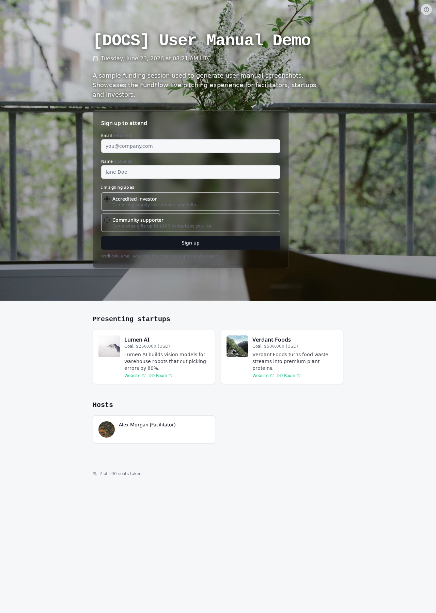

What's on this page:
- **Hero** — event name, date/time in the session timezone, description, hero image.
- **Sign up form** — email (required), name (optional), and class selector (Accredited investor / Community supporter). Signup creates a pending `session_participant` row.
- **Help button** (top right, on every page) — links to the public documentation.

> Signups are queued for facilitator approval. Once approved, the attendee receives a magic-link email and can join the session.

---

## 2. Logging in

URL: `/login`

The login page auto-targets the next active session if there is exactly one. Users enter their email and pick their role — the role buttons act as the submit.

### Step 1 — Email + role

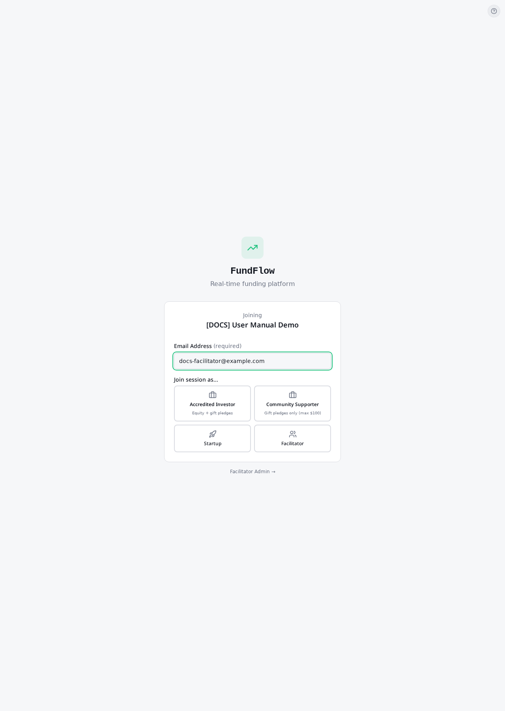

- **Accredited Investor** and **Community Supporter** are split into two side-by-side buttons so the class choice and the login submit are a single click.
- **Facilitator** and **Startup** appear below.
- All buttons are disabled until an email is entered.

### Step 2a — Facilitator password

Facilitators always re-enter their password (no auto-login):

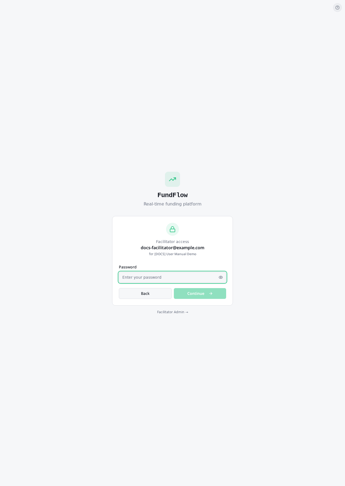

If this is a facilitator's very first invite (no password yet on any of their participant rows), they'll see a **Create password** screen instead — set a password of at least 8 characters and they're in.

### Step 2b — Investor / startup auto-advance

Startups and accredited/community investors are logged in immediately after picking their role. They land in the **Green Room** (startups, facilitators) or directly in the session (investors).

### Empty login screen

For reference, the empty login form before any input:

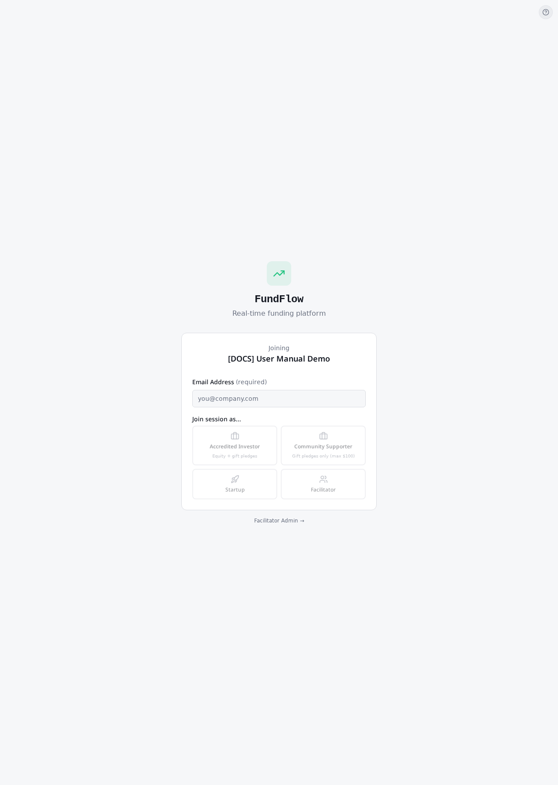

---

## 3. The Green Room (pre-event)

URL: `/session/<id>/ready`

The Green Room is a pre-flight checklist where facilitators and startups complete their profile before the session goes live. Investors skip this — they go straight to the session.

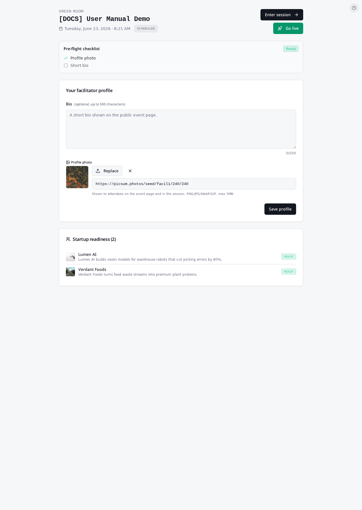

What facilitators see:
- **Pre-flight checklist** — green ticks for completed items (profile photo, bio).
- **Your facilitator profile** — bio (max 500 chars) and profile photo (PNG / JPG / WebP / GIF up to 5MB), shown on the public event page and in-session.
- **Startup readiness** — every startup's checklist visible to facilitators so they can see who's ready.
- **Enter session** (top right) — jumps into the live session interface.
- **Go live** — flips the session status from `scheduled` to `live`, which unlocks chat, presence, and the stage controls.

What startups see (their personal slice):

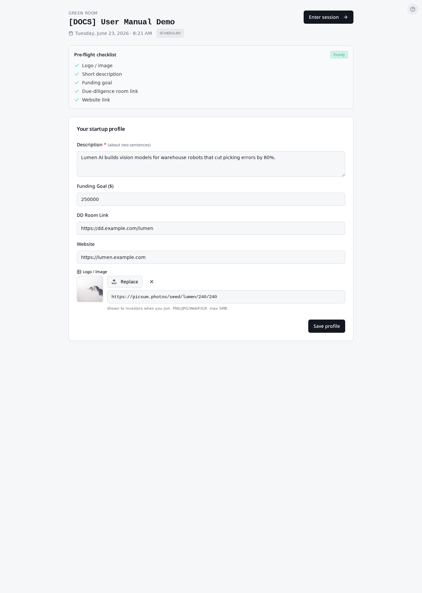

Startups fill out:
- **Company / display name**
- **One-line description and longer bio**
- **Profile photo**
- **Website link** and **Due-Diligence Room link** — surfaced to investors as buttons during the pitch.
- **Funding goal** — drives the Fund-ometer threshold visualisation.

---

## 4. The live session

URL: `/session/<id>`

The session view is a **three-pane layout** built for desktop:

| Pane | Contents |
|------|----------|
| **Left** | Stacked video tiles of facilitators (up to 3) |
| **Center** | The currently-presenting startup's video — the "stage" |
| **Right** | Live Q&A chat |

A top bar shows the running **Fund-ometer** total raised, the current stage with countdown timer, and facilitator stage controls.

### Facilitator view during Intro

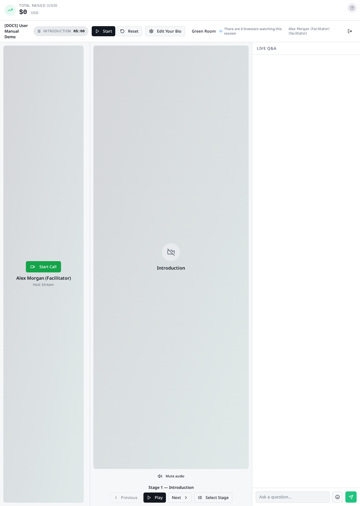

Facilitator-only controls (visible only to facilitators):

- **Start / Pause** — toggles the countdown timer for the current stage.
- **Reset** — restarts the current stage timer.
- **Edit Your Bio** — opens the profile editor without leaving the session.
- **Take Stage** (during intro/outro) — mirrors the facilitator or any startup's video into the center pane, so anyone can present from the stage during transitions.
- **Stage Selector** — jump straight to any stage in the sequence.
- **Sign out** (top right).

### Facilitator view during a startup pitch

After clicking **Next**, the session moves into the first startup's presentation stage. The center pane now shows the presenting startup; the stage label updates everywhere.

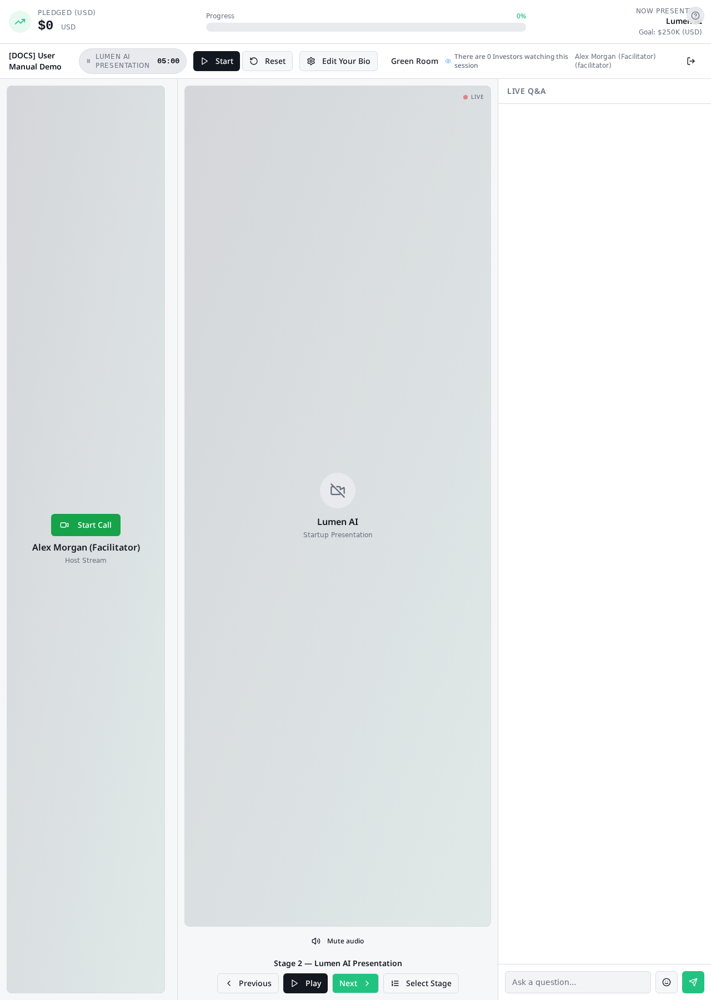

### Investor view (live)

Investors see the same three panes, but with **Invest** and **Pledge a Gift** action buttons in the top bar — enabled only during presentation and Q&A stages, disabled during the Intro and Outro.

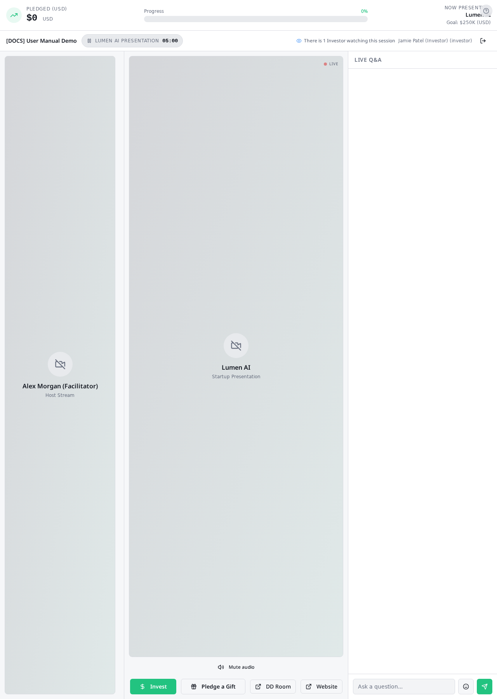

Community supporters see only the **Pledge a Gift** button (no equity commitments):

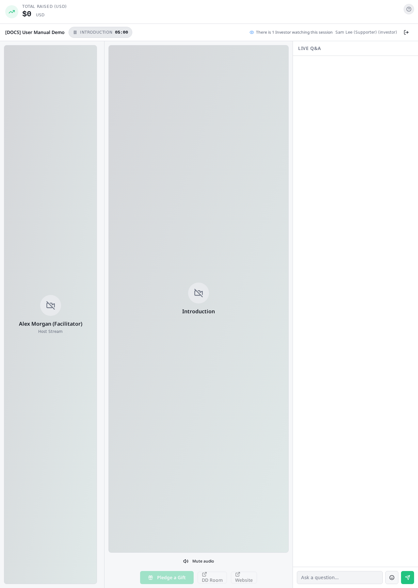

### Live Q&A and commitment messages

The right-hand chat panel shows:
- **Questions and discussion** from any attendee.
- **Commitment events**, which are **anonymized** to protect investor privacy — they appear as `An Investor committed $25,000.00` or `A Community Supporter pledged $50.00`, never with the sender's name.

---

## 5. Investing and pledging

### Accredited investor — equity commitment

Clicking **Invest** opens the soft-commitment dialog scoped to the currently-presenting startup:

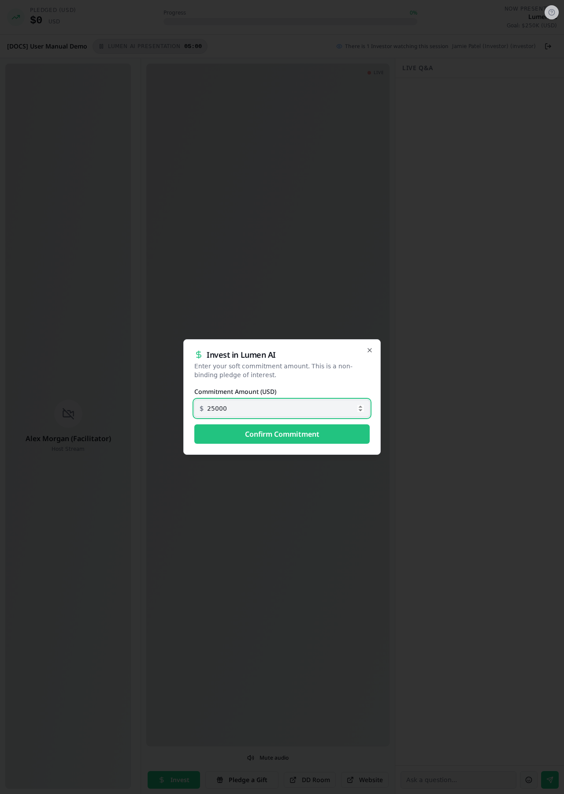

- Enter a commitment amount in USD.
- Click **Confirm Commitment** — the amount is added to the Fund-ometer total, broadcast to chat as an anonymized event, and stored in `investments`.
- Commitments are explicitly **soft / non-binding** — they signal interest.

### Community supporter — gift pledge

Clicking **Pledge a Gift** opens the same dialog with a $100 cap and the wording adjusted to "pledge":

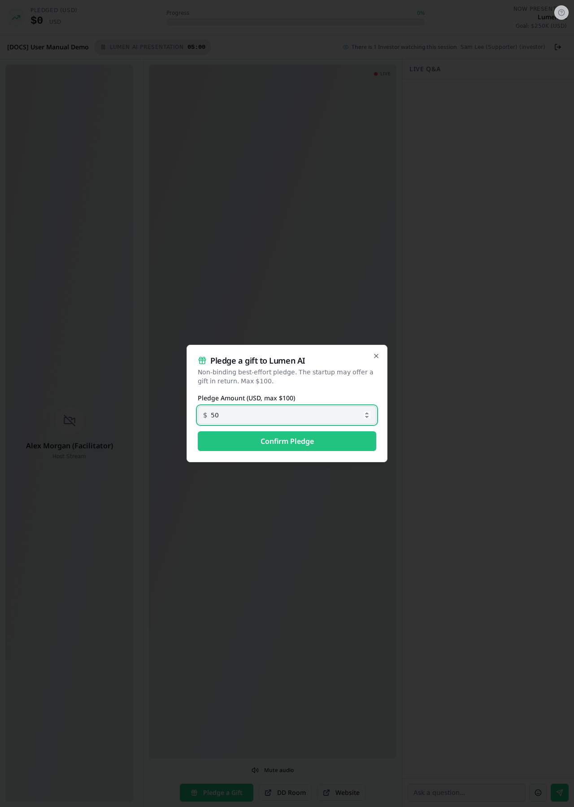

The pledge appears in chat as `A Community Supporter pledged $XX.00` and is included in the Fund-ometer total.

---

## 6. Facilitator admin dashboard

URL: `/admin`

The admin dashboard is gated by a separate facilitator email + password sign-in (the bearer token is short-lived and stored per tab).

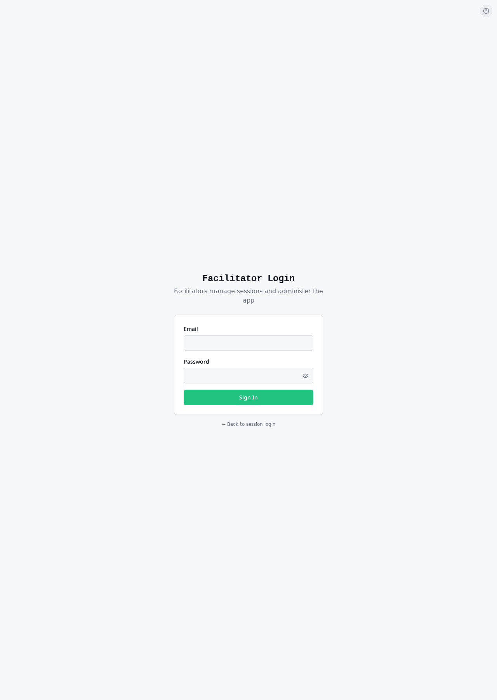

### Sessions tab

The Sessions tab lists every session in the system with status, scheduled time, and a click-through to the session detail view.

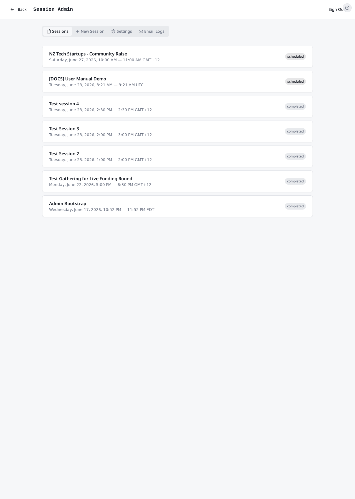

Clicking a session opens its detail view: participants by role (facilitators / startups / investors), invite/email status, approval workflow, attendance, and tools to mute, remove, re-invite, or edit any participant.

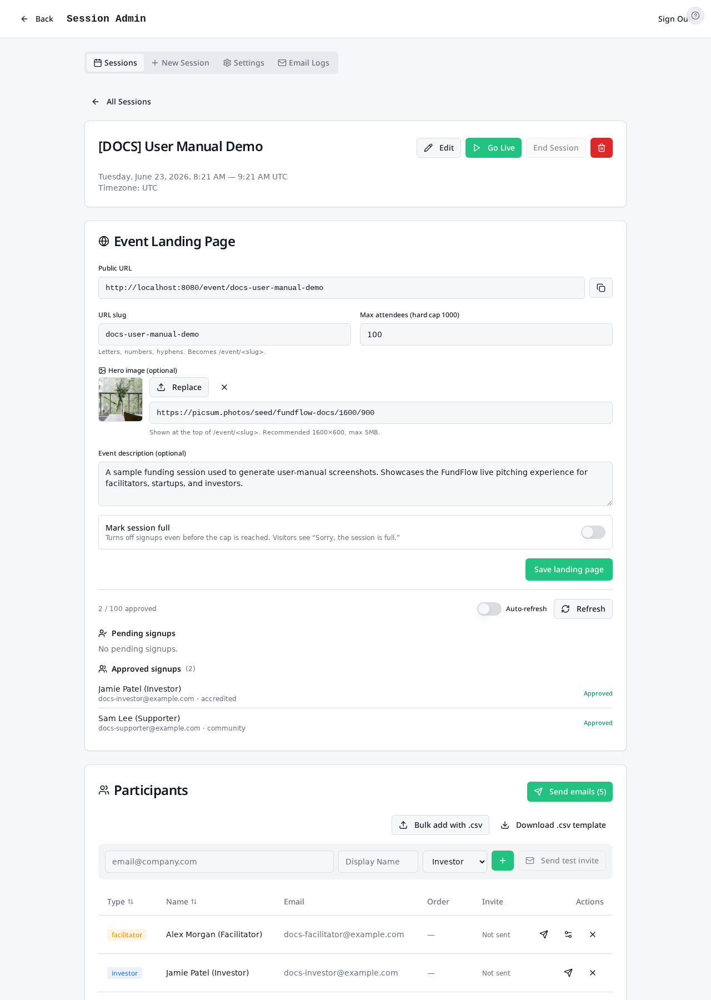

From here facilitators can:
- **Approve or reject** pending public signups from the event landing page.
- **Add participants** manually by email and role.
- **Resend** invite or magic-link emails.
- **Set the presentation order** for startups.
- **Edit the event landing page** content (title, description, hero image).
- **Archive chat** to a JSON file in private storage after the session, clearing the active chat table.

### New Session tab

Create a new session — name, slug, start/end time + timezone, hero image, description, max attendees.

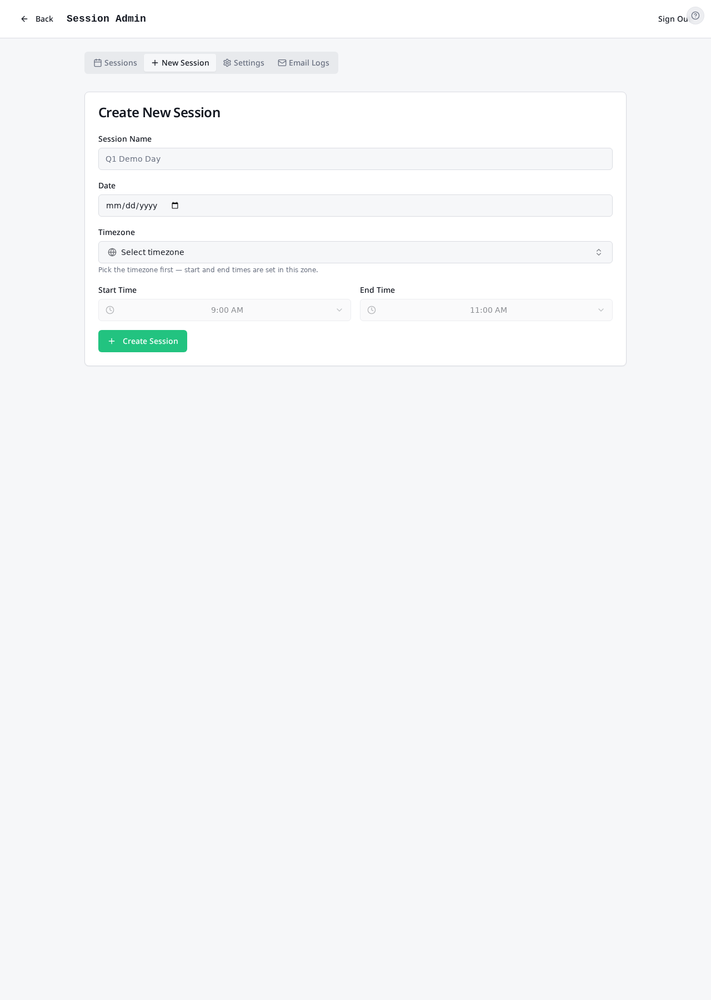

### Settings tab

Global app settings: **mode** (production vs. demo), welcome-email copy per role, LiveKit configuration banner, and the first-run bootstrap flow for brand-new deployments.

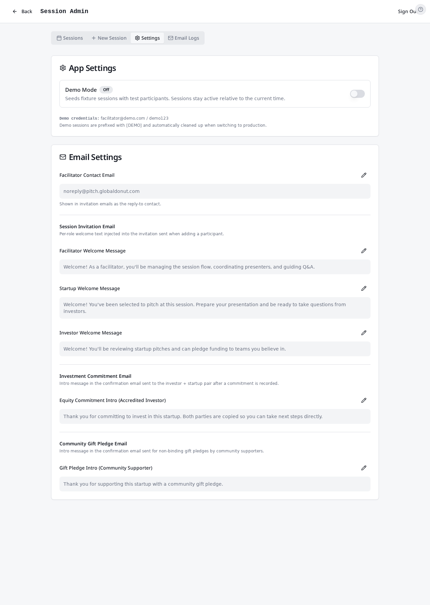

### Email Logs tab

Audit trail for every transactional email sent by the platform — recipient, template, status, timestamps, and bounce / suppression state. Useful for troubleshooting "did this person actually get the invite?" questions.

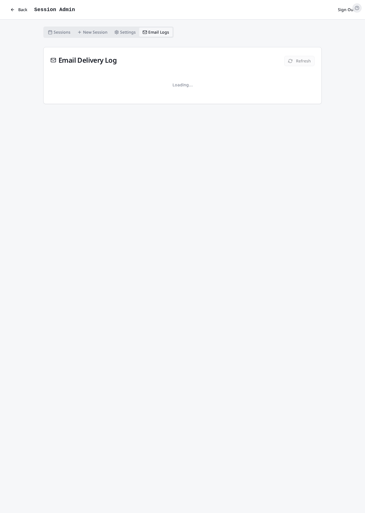

---

## 7. Account & email management

### Unsubscribe

URL: `/unsubscribe?token=…` (linked from every transactional email)

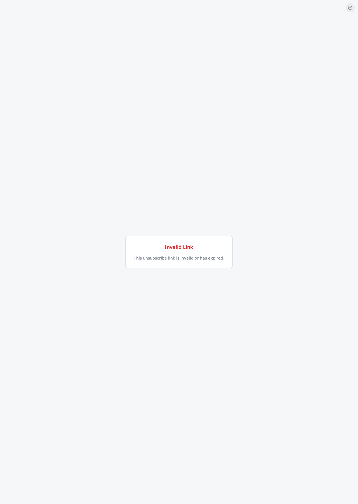

Adds the email address to `suppressed_emails` so the platform will no longer send transactional mail to it.

### Not found

URL: anything that doesn't match a route.

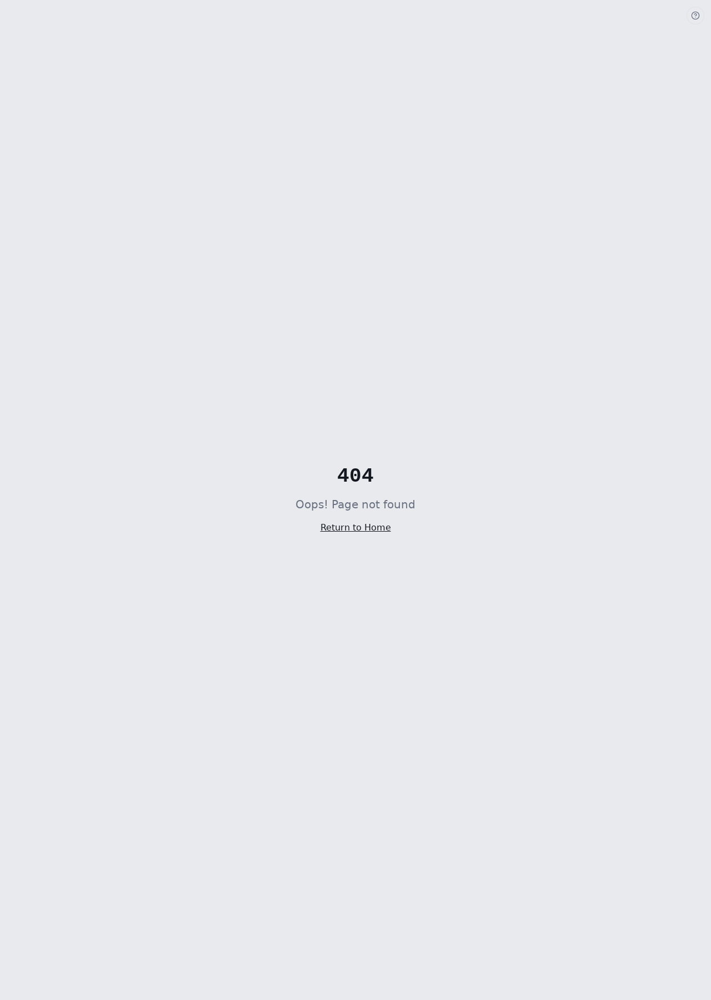

---

## 8. Reference

### Route map

| Route | Who | Purpose |
|-------|-----|---------|
| `/` | anyone | Redirects to `/login` |
| `/event/:slug` | public | Event landing & signup |
| `/login` | anyone | Email + role login |
| `/session/:id/ready` | facilitators, startups | Green Room (pre-flight) |
| `/session/:id` | all roles | The live session |
| `/admin` | facilitators | Admin dashboard (own login) |
| `/demo-logins` | facilitators (demo mode) | Auto-login shortcuts for testing |
| `/unsubscribe` | anyone | Email unsubscribe |
| `*` | anyone | 404 |

### Session lifecycle

`draft` → `scheduled` → `live` → `completed`

- **draft / scheduled** — visible on event landing, signups accepted, no live data.
- **live** — chat, presence, and stage state are active.
- **completed** — read-only; chat can be archived from the admin session detail view.

### Real-time channels

| Channel | Mechanism | What it carries |
|---------|-----------|-----------------|
| Stage sync | Supabase Realtime Broadcast + Presence | Current stage index, paused flag, remaining seconds, "stage identity" override |
| Chat | Postgres `chat_messages` changes | Live Q&A and anonymized commitment events |
| Investments | Postgres `investments` changes | Fund-ometer total updates |
| Participants | Postgres `session_participants` changes | Online/offline presence, profile updates |

### Video

All participants in a session join one LiveKit room. Tokens are minted server-side by the `livekit-token` Edge Function. If LiveKit credentials aren't configured, the video panes show a placeholder and the rest of the session still works.

---

*Generated for the FundFlow front-end. For developer docs, see `CLAUDE.md` in the project root.*
